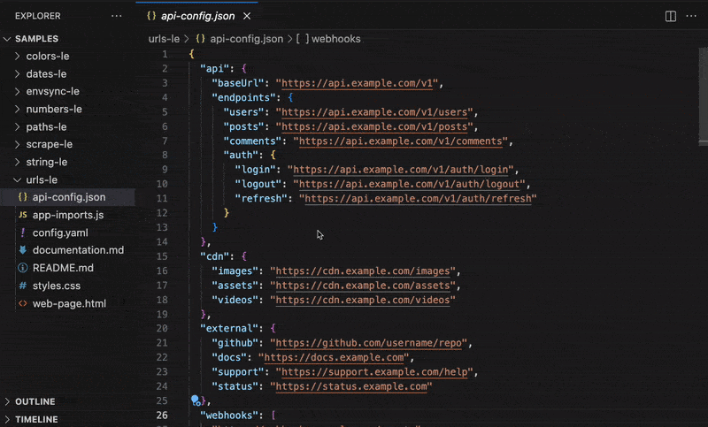
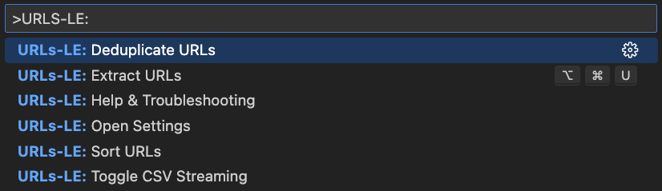

  

<h1 align="center">URLs-LE: Zero Hassle URL Extraction</h1>

  <b>Instantly extract URLs from your codebase with precision</b> 
  <i>HTML, CSS, JavaScript, JSON, YAML, XML, TOML, INI, Properties, Markdown, and more</i>

  <!-- VS Code Marketplace -->
  
  <!-- Open VSX -->
  
  <!-- Build -->
  
  <!-- License -->
  

  <i>Tested on <b>Ubuntu</b>, <b>macOS</b>, and <b>Windows</b> for maximum compatibility.</i>

---

  

  

## 🙏 Thank You

If URLs-LE saves you time, a quick rating helps other developers discover it:  
⭐ [VS Code Marketplace](https://marketplace.visualstudio.com/items?itemName=nolindnaidoo.urls-le) • [Open VSX](https://open-vsx.org/extension/nolindnaidoo/urls-le)

## ✅ Why URLs-LE?

Extract URLs from **any file format** — HTML, CSS, JavaScript, Markdown, JSON — in one click. Find API endpoints, asset links, and external resources instantly.

URLs-LE intelligently detects HTTP/HTTPS URLs while filtering out `data:` URIs and `javascript:` pseudo-protocols. Audit dependencies, validate links, and track external resources without manual searching.

- **Web development audit without the hassle**  
  Instantly extract and analyze URLs from any web project. Get comprehensive insights into API endpoints, asset references, and external links.

- **Validation across configs & APIs**  
  Surface every URL reference for validation, link checking, and resource management verification.

- **Confident edits in complex projects**  
  Flatten nested URLs into a simple list you can safely analyze without breaking structure or formatting.

- **Stream massive datasets**  
  Work with large numbers of URLs without locking up VS Code. Process large documentation and configuration files efficiently.

- **Automatic cleanup built-in**
  - **Sort** for stable analysis and reviews
  - **Dedupe** to eliminate noise
  - **Filter** by protocol or domain
- **Fast at any scale**  
  Benchmarked for 10,000+ URLs per second, URLs-LE keeps up with large web projects and enterprise monorepos without slowing you down.

## 🚀 More from the LE Family

- **[String-LE](https://marketplace.visualstudio.com/items?itemName=nolindnaidoo.string-le)** - Extract user-visible strings for i18n and validation • [Open VSX](https://open-vsx.org/extension/nolindnaidoo/string-le)
- **[Numbers-LE](https://marketplace.visualstudio.com/items?itemName=nolindnaidoo.numbers-le)** - Extract and analyze numeric data with statistics • [Open VSX](https://open-vsx.org/extension/nolindnaidoo/numbers-le)
- **[EnvSync-LE](https://marketplace.visualstudio.com/items?itemName=nolindnaidoo.envsync-le)** - Keep .env files in sync with visual diffs • [Open VSX](https://open-vsx.org/extension/nolindnaidoo/envsync-le)
- **[Paths-LE](https://marketplace.visualstudio.com/items?itemName=nolindnaidoo.paths-le)** - Extract file paths from imports and dependencies • [Open VSX](https://open-vsx.org/extension/nolindnaidoo/paths-le)
- **[Scrape-LE](https://marketplace.visualstudio.com/items?itemName=nolindnaidoo.scrape-le)** - Validate scraper targets before debugging • [Open VSX](https://open-vsx.org/extension/nolindnaidoo/scrape-le)
- **[Colors-LE](https://marketplace.visualstudio.com/items?itemName=nolindnaidoo.colors-le)** - Extract and analyze colors from stylesheets • [Open VSX](https://open-vsx.org/extension/nolindnaidoo/colors-le)
- **[Dates-LE](https://marketplace.visualstudio.com/items?itemName=nolindnaidoo.dates-le)** - Extract temporal data from logs and APIs • [Open VSX](https://open-vsx.org/extension/nolindnaidoo/dates-le)

## 💡 Use Cases

- **Web Auditing** - Extract all links and resources from HTML/CSS for validation
- **API Documentation** - Pull API endpoints from docs and code for cataloging
- **Link Validation** - Find all external URLs for broken link checking
- **Resource Tracking** - Audit CDN and asset URLs across your project

## 🚀 Quick Start

1. Install from [VS Code Marketplace](https://marketplace.visualstudio.com/items?itemName=nolindnaidoo.urls-le) or [Open VSX](https://open-vsx.org/extension/nolindnaidoo/urls-le)
2. Open any supported file type (`Cmd/Ctrl + P` → search for "URLs-LE")
3. Run Quick Extract (`Cmd+Alt+U` / `Ctrl+Alt+U` / Status Bar)

## ⚙️ Configuration

URLs-LE has minimal configuration to keep things simple. Most settings are available in VS Code's settings UI under "URLs-LE".

Key settings include:

- Output format preferences (side-by-side, clipboard copy)
- Safety warnings and thresholds for large files
- Notification levels (silent, important, all)
- Status bar visibility
- Local telemetry logging for debugging

For the complete list of available settings, open VS Code Settings and search for "urls-le".

## 🌍 Language Support

**13 languages**: English, German, Spanish, French, Indonesian, Italian, Japanese, Korean, Portuguese (Brazil), Russian, Ukrainian, Vietnamese, Chinese (Simplified)

## 🧩 System Requirements

**VS Code** 1.70.0+ • **Platform** Windows, macOS, Linux  
**Memory** 200MB recommended for large files

## 🔒 Privacy

100% local processing. No data leaves your machine. Optional logging: `urls-le.telemetryEnabled`

## ⚡ Performance

<!-- PERFORMANCE_START -->

URLs-LE is built for speed and efficiently processes files from 100KB to 30MB+. See [detailed benchmarks](docs/PERFORMANCE.md).

| Format   | File Size | Throughput | Duration | Memory | Tested On     |
| -------- | --------- | ---------- | -------- | ------ | ------------- |
| **JSON** | 1K lines  | 1,382,278  | ~1.58    | < 1MB  | Apple Silicon |
| **CSS**  | 3K lines  | 1,048,387  | ~0.31    | < 1MB  | Apple Silicon |
| **HTML** | 10K lines | 298,122    | ~4.26    | < 1MB  | Apple Silicon |

**Note**: Performance results are based on files containing actual URLs. Files without URLs (like large JSON/CSV data files) are processed much faster but extract 0 URLs.  
**Real-World Performance**: Tested with actual data up to 30MB (practical limit: 1MB warning, 10MB error threshold)  
**Performance Monitoring**: Built-in real-time tracking with configurable thresholds  
**Full Metrics**: [docs/PERFORMANCE.md](docs/PERFORMANCE.md) • Test Environment: macOS, Bun 1.2.22, Node 22.x

<!-- PERFORMANCE_END -->

## 🔧 Troubleshooting

**Not detecting URLs?**  
Ensure file is saved with supported extension (.html, .css, .js, .json, .yaml, .md)

**Large files slow?**  
Files over 10MB may take longer. Consider splitting into smaller chunks

**Need help?**  
Check [Issues](https://github.com/nolindnaidoo/urls-le/issues) or enable logging: `urls-le.telemetryEnabled: true`

## ❓ FAQ

**What URLs are extracted?**  
HTTP/HTTPS, FTP, mailto, tel, file URLs (excludes `data:` and `javascript:` pseudo-protocols)

**Can I deduplicate?**  
Yes, enable `urls-le.dedupeEnabled: true` to remove duplicates automatically

**Max file size?**  
Up to 30MB. Practical limit: 10MB for optimal performance

**Perfect for web projects?**  
Absolutely! Audit API endpoints, asset references, and external links for broken URLs

## 📊 Testing

**193 unit tests** • **71.79% function coverage, 33.66% line coverage**  
Powered by Vitest • Run with `bun test --coverage`

---

Copyright © 2025
<a href="https://github.com/nolindnaidoo">@nolindnaidoo</a>. All rights reserved.
