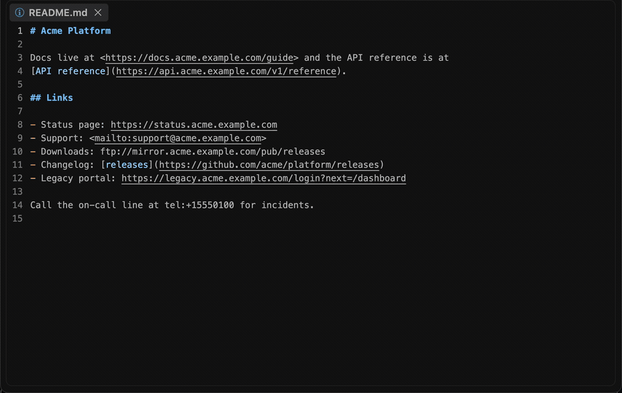

<p align="center">
  
</p>
<h1 align="center">URLs-LE: Zero Hassle URL Extraction</h1>
<p align="center">
  <b>Pull every URL out of the current file in one keystroke</b><br/>
  <i>Any text file — Markdown, HTML, CSS, JavaScript, TypeScript, JSON, YAML, Properties, TOML, INI and XML know what to exclude</i>
</p>

<p align="center">
  <a href="https://marketplace.visualstudio.com/items?itemName=nolindnaidoo.urls-le">
    
  </a>
  <a href="https://open-vsx.org/extension/OffensiveEdge/urls-le">
    
  </a>
  <a href="https://www.npmjs.com/package/urls-le-mcp">
    
  </a>
  <a href="https://crates.io/crates/urls-le">
    
  </a>
  <a href="https://letools.dev/tools/urls-le">
    
  </a>
</p>

---

<p align="center">
  
</p>

> **Useful?** A star or rating is how other developers find it —
> [★ GitHub](https://github.com/nolindnaidoo/urls-le) ·
> [★ Open VSX](https://open-vsx.org/extension/OffensiveEdge/urls-le/reviews) ·
> [★ Marketplace](https://marketplace.visualstudio.com/items?itemName=nolindnaidoo.urls-le&ssr=false#review-details)

## What it does

Open a file, press `Ctrl+Alt+U` (`Cmd+Alt+U` on Mac), and every URL in the document lands in a new editor — deduplicate and sort it from there. Works in VS Code and in VS Code–based editors like Cursor and VSCodium (installable from Open VSX).

- **Link auditing** — every link, autolink, and plain URL in Markdown and HTML (code blocks and comments excluded)
- **Source review** — URLs in string literals, template literals, and comments across JS/TS
- **Config sweep** — URLs in JSON strings, YAML values, Java properties, TOML/INI values, and XML (Maven POMs, feeds)

## Install

| Where | What you get | Install |
|---|---|---|
| **VS Code** | The extraction, in your editor, on a keystroke | [Marketplace](https://marketplace.visualstudio.com/items?itemName=nolindnaidoo.urls-le) |
| **Cursor, VSCodium, Windsurf** | The same extension | [Open VSX](https://open-vsx.org/extension/OffensiveEdge/urls-le) |
| **A terminal or a CI step** | The same run over a whole tree, with exit codes | `cargo install urls-le` · [crates.io](https://crates.io/crates/urls-le) |
| **Any MCP agent, via Node** | `extract_urls` over stdio | `npx urls-le-mcp` · [npm](https://www.npmjs.com/package/urls-le-mcp) |
| **Zed** | The MCP server as a context server | [zed-industries/extensions#7077](https://github.com/zed-industries/extensions/pull/7077) *(pending review)* |

## Use it from an AI agent

The same extraction engine runs as an [MCP](https://modelcontextprotocol.io) server, so an agent can call it directly instead of you running a command.

| Editor | How |
|---|---|
| **VS Code** 1.101+ | Nothing to install — the extension registers `extract_urls` with agent mode |
| **Zed** | [URLs-LE](https://github.com/zed-industries/extensions/pull/7077) — *pending review* |
| **Claude Code** | `claude mcp add urls-le -- npx -y urls-le-mcp` |
| **Cursor, Windsurf, anything else** | point it at `npx urls-le-mcp` |

```
extract_urls(content, format?, filename?, dedupe?, maxResults?)
```

Returns every URL with its protocol and 1-based line and column, capped at 500 by default with `meta.truncated` so a large file cannot flood the agent's context window.

The server takes content and returns data — it reads no files and makes no network requests of its own. Published as [`urls-le-mcp`](https://www.npmjs.com/package/urls-le-mcp) on npm and as `io.github.nolindnaidoo/urls-le` in the [MCP registry](https://registry.modelcontextprotocol.io).

<details>
<summary><b>Configuring it by hand</b> — any host with an MCP config file</summary>

Most hosts read a JSON config. Add one entry:

```json
{
  "mcpServers": {
    "urls-le": {
      "command": "npx",
      "args": ["-y", "urls-le-mcp"]
    }
  }
}
```

`-y` skips the install prompt on first run. Pin a version if you would rather not track releases — `urls-le-mcp@2.3.1`.

Prefer not to go through `npx` on every launch? Install it once and point at the binary instead:

```bash
npm install -g urls-le-mcp
```

```json
{
  "mcpServers": {
    "urls-le": { "command": "urls-le-mcp" }
  }
}
```

It speaks MCP over stdio and needs no environment variables, no API key and no configuration of its own. To check it before wiring it into anything:

```bash
echo '{"jsonrpc":"2.0","id":1,"method":"tools/list"}' | npx -y urls-le-mcp
```

That prints the tool list and exits — if you see `extract_urls`, the server works.

</details>

## The CLI

The same extraction runs from a terminal or a shell pipeline: a Rust CLI
in [`crate/`](crate/README.md), sharing one corpus with the extension —
[`crate/fixtures/`](crate/fixtures/) — so the two can never read a
document differently.

```bash
urls-le .                     # every URL in the tree
urls-le --dedupe docs/        # one line per distinct URL
urls-le mcp                   # the same extraction over MCP on stdio

# the point of the whole thing:
urls-le . | jq -r '.urls[].value' | sort -u | lychee -
```

**Exit codes follow grep** — 0 URLs found, 1 none found, 2 the question
was malformed — so `if urls-le src/; then …` works and finding nothing
is an answer rather than an error.

**It has no opinions, deliberately.** No link checking, no
insecure-scheme flag, no filtering. An `http://` URL is wrong in a
production config and right in a test fixture; a tool that decides for
you is one you configure, then argue with, then mute — and the muting
takes the extraction with it. Pipe it to `lychee` and let that have the
opinions.

## Supported formats

| Format | Language IDs | Notes |
|---|---|---|
| Markdown | `markdown` | Fenced code blocks and inline code excluded |
| HTML | `html` | `<!-- -->` comments excluded (multi-line supported) |
| CSS | `css` | Quoted or bare `url(...)`, `@import` |
| JavaScript / TypeScript | `javascript`, `typescript` | Strings, template literals, comments |
| JSON | `json` | String literals only, via jsonc-parser token offsets; comments are trivia |
| YAML | `yaml` | Whole content, comments included |
| Properties | `properties` | `#`/`!` comment lines excluded |
| TOML | `toml` | Parsed values only; comments excluded |
| INI | `ini` | Whole content; `;`/`#` comment lines excluded |
| XML | `xml` | Attributes and text content |
| Anything else | any | Whole document scanned; `fileType` reports `unknown` |

**No document is refused.** The eleven above know what to exclude; every
other language id — `python`, `go`, `shellscript`, `csv`, `plaintext`,
`log`, whatever your editor calls it — is scanned whole, because a URL is
unambiguous in any text and there is nothing in those worth excluding.

Extracted protocols: `http`, `https`, `ftp`, `file`, `mailto` (requires an `@`), `tel`. Every occurrence is reported with its real line and column — TOML positions are forward-located in the source and can be approximate for repeated identical values. A URL ends at whitespace or a quote/bracket delimiter, so relative links (`/docs`) and bare domains (`example.com`) are never extracted, and URLs containing raw spaces extract as space-terminated partials. Trailing `.`/`,` are kept — they are legal URL characters.

## Commands

| Command | Description |
|---|---|
| `URLs-LE: Extract URLs` (`Ctrl+Alt+U` / `Cmd+Alt+U`) | Extract all URLs from the active document |
| `URLs-LE: Deduplicate URLs` | Remove duplicate lines from the results |
| `URLs-LE: Sort URLs` | Sort results alphabetically, by domain, or by length |
| `URLs-LE: Open Settings` | Open URLs-LE settings |
| `URLs-LE: Help` | Built-in documentation |

## Settings

| Setting | Default | Description |
|---|---|---|
| `urls-le.openResultsSideBySide` | `true` | Open results beside the current editor |
| `urls-le.postProcess.openInNewFile` | `true` | Open results in a new file (when not side-by-side) |
| `urls-le.copyToClipboardEnabled` | `false` | Also copy results to the clipboard |
| `urls-le.dedupeEnabled` | `false` | Deduplicate extraction results automatically |
| `urls-le.notificationsLevel` | `silent` | `all` = every notification, `important` = warnings + errors, `silent` = errors only |
| `urls-le.safety.enabled` | `true` | Guardrails for very large files |
| `urls-le.safety.fileSizeWarnBytes` | `1000000` | Refuse extraction above this file size |
| `urls-le.safety.largeOutputLinesThreshold` | `50000` | Warn above this line count |
| `urls-le.statusBar.enabled` | `true` | Show the status bar item |
| `urls-le.telemetryEnabled` | `false` | Local-only event log (see Privacy) |

## Languages

Twelve languages besides English:

German · Spanish · French · Indonesian · Italian · Japanese · Korean ·
Portuguese (Brazil) · Russian · Ukrainian · Vietnamese · Chinese (Simplified)

Both halves are covered — the manifest (command titles, setting names and
descriptions) and everything shown while the extension runs (notifications,
the status bar, the sort quick-pick). The extension follows VS Code's display
language, so it matches whatever the editor is already set to; no setting of
its own.

## Privacy & security

- **No network access.** The extension never fetches, validates, or pings the URLs it extracts — it only reads the text of the active document. The `telemetryEnabled` setting writes events to a local Output Channel you can inspect (`URLs-LE Telemetry`); nothing leaves your machine.
- **The MCP server holds the same line.** It takes content as an argument and returns data: no filesystem access, no network calls, no telemetry. Your agent already has file-read tools, so duplicating them inside the server would add a path-traversal surface for no capability. `check:mcp-bundle` fails the build if the server ever imports something that could reach either.
- Error notifications redact home directories and credential-shaped fragments.

## Documentation

| What | Where |
|---|---|
| What the tool is allowed to say — scope, output contract, refusals, non-goals | [`crate/SPEC.md`](crate/SPEC.md) |
| How the extension is built and held together — architecture, invariants, toolchain, release | [AGENTS.md](AGENTS.md) |
| How the CLI is built and held together | [`crate/AGENTS.md`](crate/AGENTS.md) |
| What changed | [CHANGELOG.md](CHANGELOG.md) · [`crate/CHANGELOG.md`](crate/CHANGELOG.md) |
| The tool's page, and the other fifteen | [letools.dev/tools/urls-le](https://letools.dev/tools/urls-le) |

## Performance

<!-- performance:start -->
| Input | Size | Found | Time | Rate | Scan speed |
| --- | --- | --- | --- | --- | --- |
| Markdown docs | 2.63 MB | 50,000 | 61.14 ms | 817,802/sec | 43 MB/s |
| HTML page | 1.25 MB | 30,000 | 21.88 ms | 1,370,972/sec | 57 MB/s |
| JSON config | 1.52 MB | 40,000 | 39.01 ms | 1,025,358/sec | 38.8 MB/s |

Median of 7 runs after warmup, on Apple M5 Pro, 24 GB RAM, Node 24.3.0. Inputs are generated
by `scripts/benchmark.ts` rather than checked in, so the sizes above are
exactly what was measured. Reproduce with `bun run benchmark`.

These are machine-specific and are not asserted in CI — a benchmark that gates
a build only tells you how busy the runner was.
<!-- performance:end -->

## Testing

<!-- coverage:start -->
| Metric | Coverage |
| --- | --- |
| Statements | 94.18% |
| Branches | 84.48% |
| Functions | 94.33% |
| Lines | 94.44% |

322 test cases across 22 files, plus an integration suite that runs
in a real VS Code extension host and an end-to-end test that installs the
built `.vsix` into a clean profile.

Generated from a real run — `coverage/coverage-summary.json` and
`coverage/test-results.json` — by `scripts/coverage-readme.js`; CI fails if
this section drifts. Reproduce with `bun run test:coverage`, and the case
count is the one vitest prints.
<!-- coverage:end -->

## More from the LE family

Sixteen single-purpose tools for the work in front of every model. Each ships
a Rust CLI and an MCP server. One page: **[letools.dev](https://letools.dev)**

**Get it out**

- **[String-LE](https://letools.dev/tools/string-le)** — Extract every string in a codebase, with its position, so a person can read them
- **[Numbers-LE](https://letools.dev/tools/numbers-le)** — Extract every hardcoded number in a codebase, so a person can check them
- **[Units-LE](https://letools.dev/tools/units-le)** — Extract every quantity with its unit, normalized, and refuse the ambiguous ones by name
- **[Dates-LE](https://letools.dev/tools/dates-le)** — Extract every date and timestamp, and the exact instant each one resolves to
- **[IDs-LE](https://letools.dev/tools/ids-le)** — Extract every UUID, ULID, NanoID, ObjectId and Snowflake, and decode the time inside
- **[IPs-LE](https://letools.dev/tools/ips-le)** — Extract every IP address, CIDR block and MAC, normalized and classified by scope
- **[URLs-LE](https://letools.dev/tools/urls-le)** — Extract every URL in a codebase, with its protocol and exact position
- **[Paths-LE](https://letools.dev/tools/paths-le)** — Extract every file path in a codebase, and say whether it still points at anything
- **[Colors-LE](https://letools.dev/tools/colors-le)** — Extract every color in a codebase, and say which ones are not in your palette

**Check it**

- **[Regex-LE](https://letools.dev/tools/regex-le)** — Find every regex in a codebase, and report which can be driven into catastrophic backtracking
- **[Versions-LE](https://letools.dev/tools/versions-le)** — Find where one dependency is constrained differently across a repository's manifests
- **[i18n-LE](https://letools.dev/tools/i18n-le)** — Identify the i18n library a project uses, then audit its catalogs by that library's rules
- **[Scrape-LE](https://letools.dev/tools/scrape-le)** — Check whether a page is scrapeable before the scraper is written, and say when it cannot tell

**Guard it**

- **[Secrets-LE](https://letools.dev/tools/secrets-le)** — Find hardcoded credentials in a codebase, and never print one into the report
- **[EnvSync-LE](https://letools.dev/tools/envsync-le)** — Compare the dotenv files in a tree, and say which keys are missing from which
- **[Unicode-LE](https://letools.dev/tools/unicode-le)** — Find the Unicode that hides meaning — bidi controls, invisibles, homoglyphs, mixed scripts

Each stands on its own: no shared crate, no published core. Where two of them
agree, it is because the same answer was right twice.

**Contact** — [nolindnaidoo.com](https://nolindnaidoo.com) · [GitHub](https://github.com/nolindnaidoo) · [LinkedIn](https://www.linkedin.com/in/nolindnaidoo/)

## Also by nolindnaidoo

**Rust** — pixelcoords and pixelactions are one loop: pixelcoords answers
*where*, pixelactions *acts* there. Their own tools, their own voice — not
part of the LE family.

- **[pixelcoords](https://github.com/nolindnaidoo/pixelcoords)** — Freeze your screen, mark regions, get pixel-exact coordinates and crops
  [pixelcoords.dev](https://pixelcoords.dev) · [crates.io](https://crates.io/crates/pixelcoords) · [docs.rs](https://docs.rs/pixelcoords)
- **[pixelactions](https://github.com/nolindnaidoo/pixelactions)** — Consume human-verified coordinates, perform the interaction, confirm it landed
  [pixelactions.dev](https://pixelactions.dev) · [crates.io](https://crates.io/crates/pixelactions) · [docs.rs](https://docs.rs/pixelactions)

## License

MIT © [nolindnaidoo](https://github.com/nolindnaidoo)
